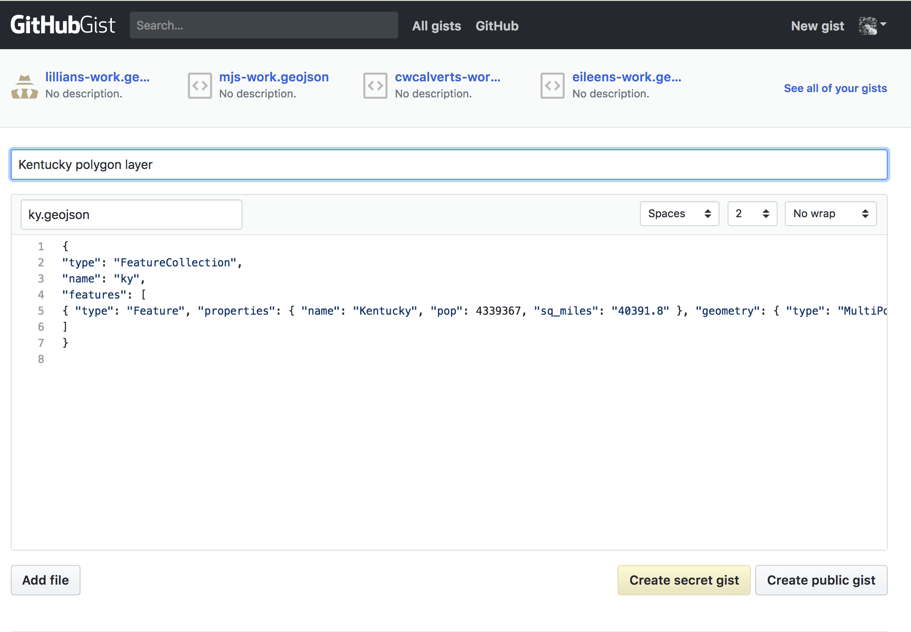

# Module 02 Lab Assignment

## Table of contents

<!-- TOC -->

- [Module 02 Lab Assignment](#module-02-lab-assignment)
    - [Table of contents](#table-of-contents)
    - [Overview](#overview)
    - [Data files](#data-files)
        - [Project setup](#project-setup)
        - [Connecting dataset](#connecting-dataset)
    - [Required specifications of the deliverable](#required-specifications-of-the-deliverable)
        - [Submission](#submission)
    - [Example for Colorado](#example-for-colorado)
    - [Suggestions and Tips](#suggestions-and-tips)
    - [Challenge](#challenge)

<!-- /TOC -->

## Overview

You've been contracted by HydroTime to collect and map stream data by state. They are interested in visualizing major stream networks and urban areas. Your contract specifies that you should pick your home state to map, and a bonus is given if you provide summary statistics for streams in your state.

We will collect and analyze the data in this module and create the map layout in the following module. Part of the challenge of a mapping project is managing data. This lab has a big dataset that we need to prune down before we start mapping.

The requirements of the map are listed below. You will submit all deliverables as files in this GitHub repository. All the tasks required to fulfill this assignment are documented within Module 02.

## Data files

The following data were downloaded from [The National Map Small-Scale Collection](https://nationalmap.gov/small_scale/atlasftp.html). The layers have been combined into a single SpatiaLite database.

### Project setup
1. If you haven't already, create a folder called "downloaded-data" in a directory alongside this repository.
2. Download the SpatiaLite database:
[https://www.dropbox.com/s/k1toqh37ugqos3o/US_SmallScale_Data_NAD83.zip?dl=0](https://www.dropbox.com/s/k1toqh37ugqos3o/US_SmallScale_Data_NAD83.zip?dl=0)
3. Extract the .zip file to the *downloaded-data*. This is a large file and we don't want it in our repository. _*.zip_ and _*.sqlite_ will be ignored by Git with the settings in the *.gitignore* file. **Please don't change the *.gitignore* file or rename the *US_SmallScale_Data_NAD83.sqlite* file**! You could create an annoying error in GitHub.
4. If you see a .zip or .sqlite in your GitHub Desktop *Changes* tab, don't commit it! Instead remove the file from your repo and/or check that the _*.zip_ and _*.sqlite_ are listed in the *.gitignore* file.

   
Figure 01: Example of your directory setup for this course. Keep your downloaded-data outside of your repository.

### Connecting dataset

1. Open QGIS's **Browser Panel** and right-click **SpatiaLite > New connection**. Navigate to the .sqlite file and connect the database.    
    
*Connecting the database in QGIS Browser panel*
2. Add layers to your Map canvas. Note, that items in the SpatiaLite database prefixed `idx` are not layers. They are indexes and should not be added to the map.
3. If you have set up a PostGIS database, import these layers with DB Manager. In the import options for DB Manager's **Import vector layer** menu, click **Update Options** and enable **Convert field names to lowercase**.
4. Filter the layers for your state of interest with either Query Builder or SQL in DB Manager.
5. Export to GeoJSON.
6. Delete the .zip and .sqlite files.

That's how we manage data into our workflow.


## Required specifications of the deliverable

1) The client has also requested a SQL file that extracts streams, state polygon, urban areas, and waterbodies for **one state**. The SQL file must fulfill the following requirements:

* Pick any state covered by the data and create four layers of data that cover this state.
* Use the starter template in *lab-02/data.sql* to write your SQL statements that extracts data either from a database or with a **Filter... > Query Builder** expression (i.e., what you entered in the **Provider specific filter expression** dialog). Include a statement or expression for each layer. Use comments in your SQL file to help readers understand what each statement accomplishes.


2) The client has also requested a copy of these layers as a custom GeoJSON format. The GeoJSON must fulfill the following requirement:

* Export your layers as GeoJSON layers (*.geojson*) and store them in the folder located at *lab-02/geojsons/*. You should right-click each layer and **Save as...** to a GeoJSON.
* Coordinate Reference System must be WGS84.
* Coordinate precision of no more than four.
* Attribute requirements per layer (exclude all attributes except those listed):
  * Stream layer: name, length_mi, and stream order
  * Urban areas layer: name, gis_acres
  * Waterbodies layer: name, feature, area_sq_miles
  * State layer: name
* Add the *.geojson* file to the folder located at *lab-02/geojsons/*
* Create a "README.md" file in the *lab-02/geojsons/* folder that describes its contents, e.g., what state did you select, what data format, attributes, and geometries are presented, what is their coordinate reference system, and what is the source of the data?
* **No GeoJSON can be over 20 MB**.

Commit your changes often and push the changes before you submit your repository link.

### Submission

Paste URL link within the Canvas to this repo, e.g., *https://github.com/newmapsplus/map671-module-02-username*.


## Example for Colorado
   
***Save as...** to a new GeoJSON for each layer*

    
*Select attributes and reduce coordinate precision*

## Suggestions and Tips

If you find that your map is rendering too slowly after you queried your layers (especially the streams layer), you have a couple options:

* Disable rendering via the **Render** option in Map Canvas status bar.
* **Filter...** the data to a smaller dataset before using in Map Canvas or importing into the PostGIS database.
* Use a `create table as` in DB Manager before adding the layer to Map Canvas.
* Note, SpatiaLite databases can be queried in DB Manager (on Linux and Windows OS).

If you use the `limit` clause you can speed-up simple queries:

```
select
  *
from
    nhd_streams
limit
  100
```

## Challenge

Embed a GeoJSON layer in the *index.html* file using a GitHub *gist*. This challenge demonstrates how to quickly use the GitHub feature of displaying small amounts of spatial data. If formatted properly, the map will be displayed with attributes on your web page. This is a cool way to share data and make sure it is compatible for web mapping. Since you'll be editing GeoJSON text files, use [VS Code](https://code.visualstudio.com/) or [Sublime Text](https://www.sublimetext.com/3) editors, both of which can handle large files.

Here are the steps. You can select any of your layers to embed. This example uses the state polygon layer.

1) Open your text editor and remove one line of text:
`"crs": { "type": "name", "properties": { "name": "urn:ogc:def:crs:OGC:1.3:CRS84" } },`
    
*Make sure you only change this one line!*

2) Create a new gist on your GitHub.com page:
    
*Creating a new gist*

3) Copy and past the entire contents of the GeoJSON text and give the `.geojson` file extension.
    
*Pasting content into a new gist*

4) Save the gist (either public or secret) and copy the `Embed` code
    
*Copy Embed code*

5) Open your the *index.html* file in this folder and paste this code above the footer list tag `<ul>` that contains your social media footprint:

```html
<!-- This gist is a map showing Kentucky's state polygon -->
<script src="https://gist.github.com/boydx/72e0c3a071914a8bc6b132c8f6d0ea4f.js"></script>

<ul>
	<!-- Change the following contacts to your personal brand, whatever you want it to be! -->
	<li>See my projects on GitHub: <a href="https://github.com/newmapsplus">New Maps Plus</a></li>
	<li>Follow me on twitter: <a href="https://twitter.com/NewMapsPlus">@NewMapsPlus</a></li>
	<li>Visit my <a href='#'>mapping portfolio</a>.</li>
</ul>
```

6) Save your *index.html*, commit the addition, with a good summary, and push the change to your remote repo.